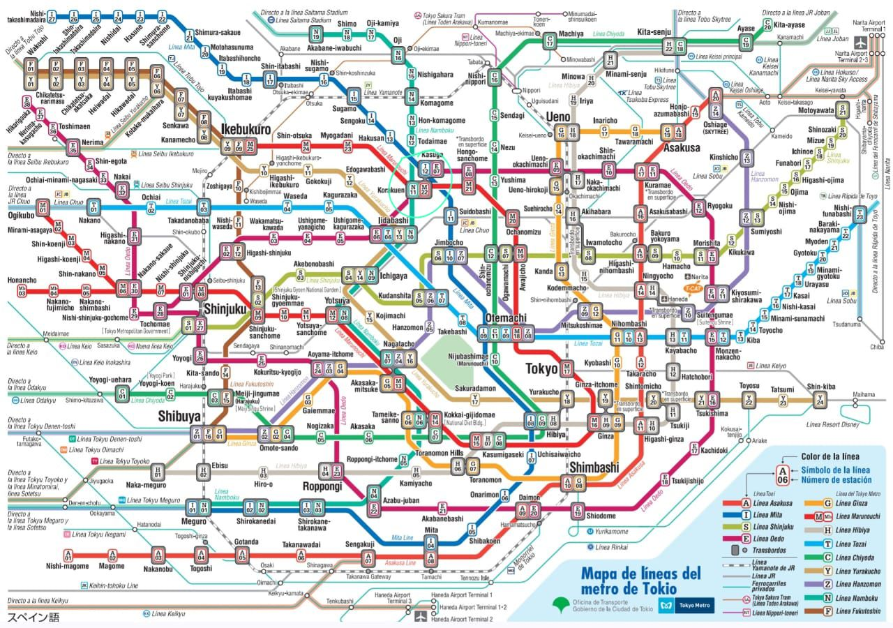

# Parcial 2: Algoritmos de búsqueda

Universidad Nacional Autónoma de México 
Facultad de Ingeniería 
Inteligencia Artificial 

Integrantes:
- Juarez valdez Israel 
- Portillo Jaramillo David
- Velasco Pérez Angel David
- Villanueva Pérez Vianey
- Zarco Hernández Evandher Joel

## A* aplicado a rutas del metro de Tokio
Implementar A* para encontrar la mejor ruta para llegar a **Akihabara** partiendo de **Nishi-takashimaradai**

Se utilizo como base el siguiente mapa que muestra la distribución de las líneas de metro en Tokio

En primera instancia se aplico el algoritmo de búsqueda A* en una prueba manual para encontrar la estación **Akihabara** iniciando en la estación **Nishi-takashimaradai**, 
esto para tener un resultado esperado. El desarrollo de este ejercicio se muestra en la siguiente imagen.

El codigo se desarrollo en python y se puede identificar en la carpeta raíz con el nombre **AStar_Examen**, tambien se puede acceder a el desde [aqui](./AStar_Examen.ipynb).
Los resultados obtenidos se muestran en siguiente imagen. 

Al realizar una comparativa tenemos que se llego a la solución esperada, podemos observar las estaciones que se siguieron para llegar al objetivo y el costo total. Estos resultados se obtuvieron tras 
300 iteraciones, el log completo se encuentra en el documento de [python](./AStar_Examen.ipynb) 

